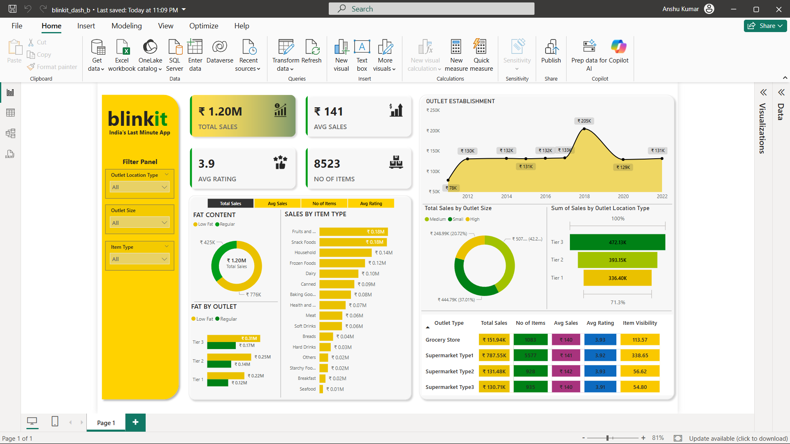

# Blinkit-DashBoard

This Power BI dashboard gives a clear and interactive look at Blinkit's grocery sales performance. It highlights key metrics like total sales, average sales, number of items sold, and customer ratings. With filters for outlet location, size, and item type, users can easily explore specific areas of interest and get tailored insights without needing to dig through raw data.

The visuals break down sales by fat content, item categories, outlet tiers, and sizes, making it easy to spot trends and compare performance. A time-based chart shows how sales have changed over the years, while a summary section highlights how different types of outlets are doing in terms of revenue, customer satisfaction, and product visibility. Overall, the dashboard is built to help make smarter decisions using data in a simple, intuitive way.

